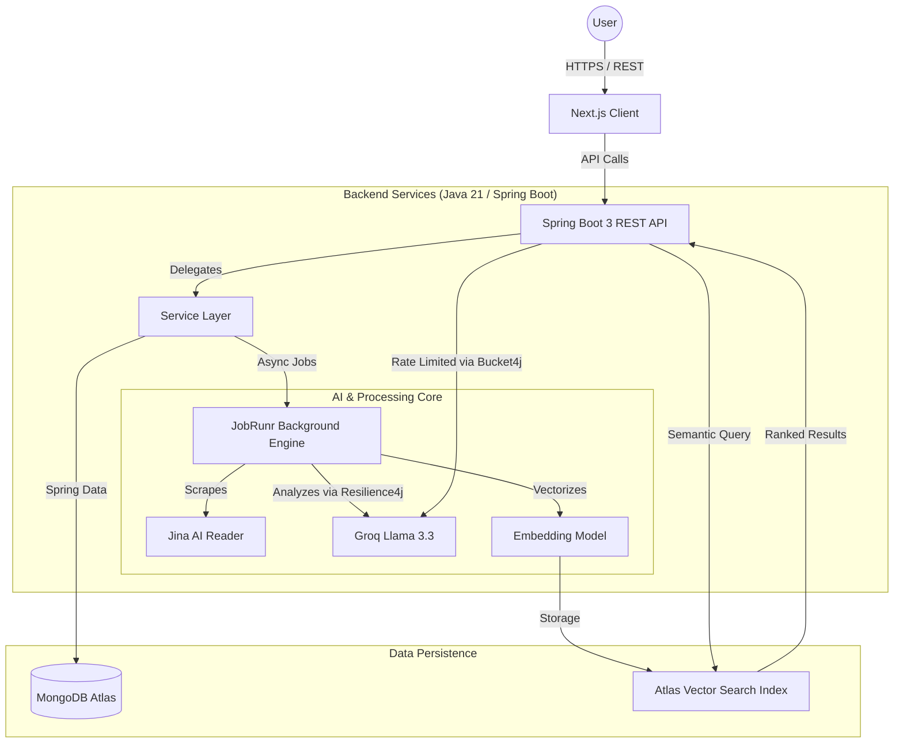

# NextLevel: Intelligent Knowledge Operating System

NextLevel is a high-performance, enterprise-grade platform designed to consolidate digital information into a single, intelligent knowledge vault. It leverages state-of-the-art AI orchestration and durable background processing to transform raw data into actionable, searchable knowledge.

---

## Problem and Solution

**The Problem:**
Information overload limits productivity. Professionals and students constantly gather links, notes, documents, and code snippets, but finding and synthesizing this data when needed is complex. Traditional note-taking applications rely on rigid keyword searches and manual tagging, creating friction in retrieving critical information. Furthermore, most systems lack automated workflows to summarize or categorize data at scale.

**The Solution:**
NextLevel introduces an "AI-First" knowledge architecture. Instead of relying on manual organization, the system ingests raw inputs (URLs, text, files) and automatically extracts meaning, generates summaries, and assigns categories. By utilizing vector embeddings and semantic search, users can query their knowledge base conceptually (e.g., searching for "database scaling" will return notes on "sharding" even if the exact keywords do not match).

---

## System Architecture



---

## Technical Stack

NextLevel is built with a focus on reliability, scalability, and modern engineering practices.

### Backend (Core Services & API)
*   **Framework**: Java 21 / Spring Boot 3
*   **Architecture**: Multi-tier architecture (Controllers, Services, Repositories, DTOs)
*   **Background Processing**: JobRunr for durable, fault-tolerant asynchronous task execution
*   **Resilience & Rate Limiting**: Resilience4j (Circuit Breakers & Retries) and Bucket4j
*   **Security**: Spring Security, JWT Authentication, OAuth2 (Google), Method-level Security
*   **API Documentation**: SpringDoc OpenAPI (Swagger UI)

### Frontend (Client Application)
*   **Framework**: Next.js (App Router, Turbopack)
*   **Styling**: Tailwind CSS, Framer Motion
*   **State Management**: React Hooks & Context API

### Infrastructure & Database
*   **Database**: MongoDB Atlas (Document Store)
*   **Search**: MongoDB Atlas Vector Search
*   **AI Integration**: Spring AI (Groq API, Llama-3.3)

---

## Key Features

### 1. Semantic Knowledge Retrieval
*   **Conceptual Search**: Utilizes vector cosine similarity to locate notes based on meaning rather than exact keyword matches.
*   **Implementation**: Powered by MongoDB Atlas Vector Search combined with 768-dimensional embeddings generated by Google's text-embedding-004 model.

### 2. Durable AI Workflows
*   **Automated Enrichment**: URLs and notes are asynchronously scraped (via Jina AI) and summarized (via Groq/Llama).
*   **Fault Tolerance**: The integration of JobRunr and Resilience4j ensures that failing external API calls are retried with exponential backoff and circuit breakers prevent cascading system failures.

### 3. Intelligent Data Categorization
*   **Auto-Triage**: The AI engine automatically detects if a captured input is an exam, project, deadline, or general resource.
*   **Urgency Detection**: Flags critical notes and deadlines automatically, integrating them into user workflows.

### 4. Spaced Repetition & Gamification
*   **Algorithmic Review**: Implements the SM-2 spaced repetition algorithm to schedule optimal review intervals based on user recall quality.
*   **Engagement Engine**: Gamification system awarding XP and dynamic level progression for completed study sessions and flashcards.

### 5. Assessment Hub & AI Question Generation
*   **Document Upload**: Upload PDF, Word (.docx), TXT, or JSON files directly into the platform.
*   **AI Extraction**: Automatically extracts text and uses LLMs to generate high-quality multiple-choice questions (MCQs) mapped to the source document.
*   **Simulation & Study Modes**: Group questions by their source document, run timed exam simulations, or practice with SRS study mode.

### 6. Interactive Knowledge Graph & AI Chat
*   **Visual Topography**: 2D force-directed knowledge graph mapping semantic connections between isolated captures.
*   **SSE Streaming Chat**: Real-time contextual AI assistant using Server-Sent Events (SSE) for low-latency RAG conversations.
*   **Deep Focus**: Integrated Pomodoro study timer with automated background session logging.

---

## Getting Started

### 1. Prerequisites
*   Java 21 / Maven
*   Node.js 18+
*   MongoDB Atlas Account (with Vector Search capabilities)
*   Google AI Studio API Key & Groq API Key

### 2. Installation & Setup

Clone the repository:
```bash
git clone https://github.com/Animesh-86/NextLevel.git
cd NextLevel
```

### 3. Backend Setup

Configure the environment variables in `backend-spring/src/main/resources/application.yml` or via `.env`:
```env
MONGODB_URI=mongodb+srv://<user>:<password>@cluster.mongodb.net/nextlevel
GROQ_API_KEY=your_groq_api_key
GEMINI_API_KEY=your_gemini_api_key
GOOGLE_CLIENT_ID=your_oauth_client_id
GOOGLE_CLIENT_SECRET=your_oauth_client_secret
JWT_SECRET=your_secure_jwt_secret
```

Build and run the Spring Boot application:
```bash
cd backend-spring
mvn clean install
mvn spring-boot:run
```

### 4. Frontend Setup

Navigate to the frontend directory and install dependencies:
```bash
cd frontend
npm install
```

Start the development server:
```bash
npm run dev
```

### 5. Vector Search Configuration
Within the MongoDB Atlas console, define a Vector Search Index on the `captures` collection using the following JSON definition:
```json
{
  "fields": [
    {
      "numDimensions": 768,
      "path": "embedding",
      "similarity": "cosine",
      "type": "vector"
    }
  ]
}
```

---

## API Documentation
Once the backend is running, the interactive OpenAPI specification and Swagger UI can be accessed at:
`http://localhost:8080/swagger-ui.html`

---

## Future Enhancements
*   Multi-file PDF ingestion and Retrieval-Augmented Generation (RAG).
*   Collaborative vaults with Role-Based Access Control (RBAC).
*   Calendar integrations (Google Calendar, Microsoft Outlook) for automated deadline syncing.

*Maintained by Animesh*
