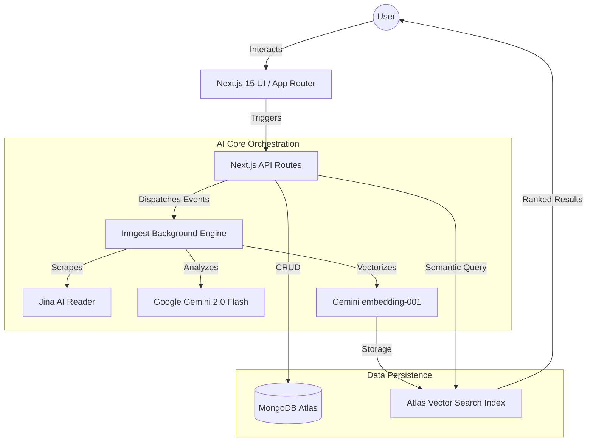

# 🚀 NextLevel: The AI-First Knowledge Operating System

NextLevel is a high-performance, professional-grade platform designed to consolidate your digital life into a single, intelligent vault. It leverages state-of-the-art AI orchestration and durable background processing to turn raw information into actionable knowledge.

---

## 🏗 System Architecture



---

## 🔥 Key Features

### 1. 🧠 Semantic "Brain" Search
*   **Beyond Keywords**: Uses vector cosine similarity to find notes based on *meaning*. Search for "Spring Boot help" and find notes about "Java backend tutorials" automatically.
*   **Powered By**: MongoDB Atlas Vector Search + Gemini 768-dim embeddings.

### 2. ⚡ Durable AI Workflows (Inngest)
*   **Reliable Scrapping**: Every link you save is instantly scraped via Jina AI and summarized by Gemini.
*   **Fault Tolerance**: If an AI call fails, Inngest automatically retries with exponential backoff.
*   **No-Code Replacement**: Successfully replaced heavy n8n dependencies with native, high-performance Javascript functions.

### 3. 📝 Smart Captures & Vault
*   **Auto-Categorization**: AI detects if a note is an `Exam`, `Project`, or `Deadline`.
*   **Urgency Detection**: Automatically flags notes as `Critical` or `High` based on the content.
*   **PWA Support**: Fully installable as a mobile app for on-the-go capturing.

### 4. 🗺 AI Roadmap Generator
*   **Pathfinding**: Generate structured learning roadmaps for any topic (e.g., "Learn Kubernetes in 4 weeks").
*   **Milestone Tracking**: Tracks your progress through AI-generated steps.

### 5. 📅 Dynamic Planner & Reminders
*   **Calendar Integration**: View your AI-detected deadlines in a unified planner.
*   **Smart Reminders**: System-suggested reminder times based on task urgency.

### 6. 🎓 Exam & Test Engine
*   **Mock Tests**: Take practice exams and track results.
*   **Performance Analytics**: Deep dives into your test scores over time.

---

## 🛠 Tech Stack

| Layer | Technology |
|---|---|
| **Framework** | Next.js 15 (App Router / Turbopack) |
| **Styling** | Tailwind CSS 4 + Framer Motion |
| **Database** | MongoDB Atlas (Vector Search Enabled) |
| **AI (LLM)** | Google Gemini 2.0 Flash |
| **AI (Embeddings)** | Google text-embedding-004 |
| **Orchestration** | Inngest (Event-Driven Architecture) |
| **Authentication** | NextAuth.js |

---

## 🚀 Getting Started

### 1. Prerequisites
*   Node.js 18+ & MongoDB Atlas account.
*   Google AI Studio API Key.

### 2. Installation
```bash
git clone https://github.com/Animesh-86/NextLevel.git
npm install
```

### 3. Environment Config (`.env.local`)
```env
MONGODB_URI=...
GEMINI_API_KEY=...
AUTH_SECRET=...
NEXTAUTH_URL=http://localhost:3000
```

### 4. Vector Search Index Setup
In your MongoDB Atlas dashboard, create a **Vector Search Index** on the `captures` collection:
```json
{
  "fields": [
    {
      "numDimensions": 768,
      "path": "embedding",
      "similarity": "cosine",
      "type": "vector"
    }
  ]
}
```

### 5. Development
Start the app:
```bash
npm run dev
```

Start the background worker:
```bash
npx inngest-cli@latest dev -u http://localhost:3000/api/inngest
```

---

## 🤝 Roadmap & Future
- [ ] Multi-file PDF Analysis (RAG).
- [ ] Collaborative Vaults for Teams.
- [ ] Integration with Google Calendar/Outlook.

Built with ❤️ by [Animesh](https://github.com/Animesh-86)
